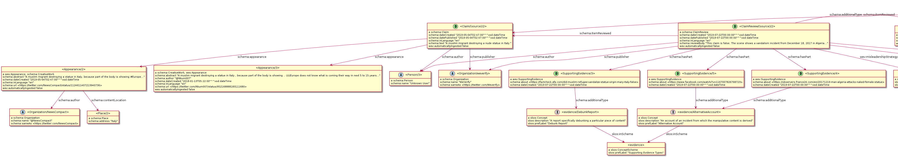

# Examples of reviewed claims


Examples is from "Ideas for the blockchain database" [document](https://docs.google.com/document/d/1S7PU6D2ULBo8xkPgKiTA9ejE1DVzmbj7dZ1mj5eU7G8) 




### schema:Claim 

The claim represents a statement, without judgement. It can be true or false. 
* The `schema:appearance` predicate points to the actual manifestations of the claim in various bits of content, described in Schema.org
* `schema:text` contains the text of the claim 


```ttl
<Claim/1> a schema:Claim ;
    schema:text "A muslim migrant destroying a nude statue in Italy." ;
    schema:dateCreated "2019-05-04T02:47:00"^^xsd:dateTime ;
    schema:author <Person/3> ;
    schema:appearance <SocialMediaPosting/1> ;
 .
```

### schema:ClaimReview

The claim review is the creative output of a given author, judging a particular claim. The `schema:reviewBody` literal is a textual summary of the review.

We use `schema:hasPart` to link the Review Body to one or more pieces of supporting evidence. 


Optionally we can use `schema:additionalType` to link the claim review to a skos thesaurus containing the possible types of judgement (Debunk, Validate etc)
We can also follow the same pattern to add business-specific nuances without altering the model. To illustrate that here we use a (somewhat clunky) custom predicate `wev:misledershipStrategy` to link to an item from a SKOS thesaurus containing a specific taxonomy of misleadership strategies. They can be "change of location", "altered image" etc... 


```ttl
<ClaimReview/1> a schema:ClaimReview ;
    schema:itemReviewed <Claim/1> ;
    puml:left <Claim/1>  ;
    schema:author <Organization/1> ;
    schema:dateCreated "2019-07-22T00:00:00"^^xsd:dateTime;
    schema:reviewBody "This claim is false. The scene shows a vandalism incident from December 18, 2017 in Algeria..." ;
    schema:hasPart <SupportingEvidence/1> ;
    schema:hasPart <SupportingEvidence/2> ;
    schema:hasPart <SupportingEvidence/3> ;
    schema:additionalType <reviewType/Debunk> ;
    wev:misleadershipStrategy <strategy/Location> ;
.
```

### wev:SupportingEvidence

Supporting Evidenceis a subclass of `schema:CreativeWork` and is a statement that a given piece of content is evidence supporting a given claim review. 
The `schema:text` literal can be used to write down additional information on the nature of the supporting evidence.
`schema:additionalType` points to a SKOS thesaurus containing types of supporting evidence, such as "Debunk Report" or "Alternative Account".
In this example 3 pieces of supporting evidence are linked to the review. 2 are "weaker", representing alternative accounts of the incident, and the third is stronger, a dedicated debunk report of the video. 
This is for now the only extension of Schema in the WEV model
  
```ttl
<SupportingEvidence/1> a wev:SupportingEvidence, schema:CreativeWork;
    schema:about <Article/1> ;
    schema:additionalType <evidence/DebunkReport> ;
    schema:dateCreated "2019-07-22T00:00"^^xsd:dateTime ;
.    
<SupportingEvidence/3> a wev:SupportingEvidence, schema:CreativeWork ;
    schema:about <SocialMedia/2> ;
    schema:additionalType <evidence/AlternativeAccount> ;
    schema:dateCreated "2019-07-22T00:00"^^xsd:dateTime ;
.
```

## Example 2

Here is the example concerning the claim that "Refugees organized a pique-nique in a Cemetery in Calais"

